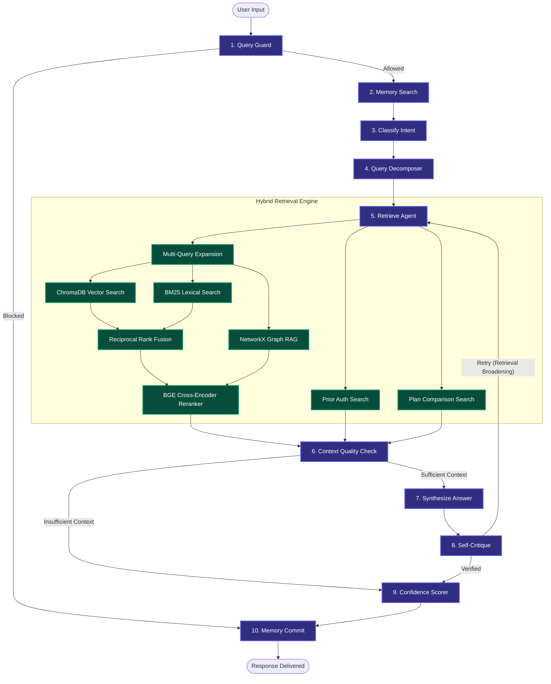

# 🏥 Health Insurance AI Copilot & Graph RAG Pipeline

A production-grade, stateful AI copilot engineered for answering complex, structured and unstructured health insurance policy queries. Built with **FastAPI**, **Streamlit**, **LangGraph**, **Mem0**, **Docling Layout-Aware Parsing**, **NetworkX Knowledge Graphs**, and **OpenAI GPT-4o**.

### 🚀 **Live Demo on Hugging Face Spaces**
Explore the interactive demo and execute live queries directly here:
**👉 [Health Insurance AI Copilot Demo](https://huggingface.co/spaces/Nagendravarma/Health-Insurance-RAG)**

---

## 🧠 **Interactive Developer Console**
To facilitate inspection and debugging, the **RAG Developer Console** is **completely unlocked (no password required)**. It visualizes the live LangGraph execution path, node latency, retrieved contexts, and retrieval scores in real time.
* Access the console via the link on the Streamlit UI or directly at `/dev-console` when running the application.

---

## 📊 **Agentic System Architecture**

The agent is orchestrated as a directed state machine featuring **10 custom nodes** and conditional routing loops built with **LangGraph**:



### **The 10-Node Workflow Breakdown**
1. **`query_guard`**: Detects and redacts PII (SSNs, MRNs, credit cards) and filters out-of-topic queries.
2. **`memory_search`**: Recalls user facts (plan tier, preferences, history) from the `Mem0` session database.
3. **`classify_intent`**: Uses `gpt-4o-mini` to categorize the query (`SIMPLE_LOOKUP`, `POLICY_QUESTION`, `MULTI_HOP`, `COMPARISON`) for optimal retrieval routing.
4. **`query_decomposer`**: Splits complex multi-hop questions into independent, atomic sub-questions.
5. **`retrieve`**: Dynamically routes and queries vector databases, lexical indices, and knowledge graphs concurrently.
6. **`context_quality_check`**: Validates retrieved context richness. Bypasses synthesis if information is insufficient to prevent hallucination.
7. **`synthesize`**: Generates a cited final answer using `gpt-4o` combined with custom prompts and conversation history.
8. **`self_critique`**: Evaluates answer specificity and citation completeness. Triggers a retrieval-broadening retry if checks fail.
9. **`confidence_scorer`**: Rates final answer confidence (HIGH/MEDIUM/LOW) using citations and context size.
10. **`memory_add`**: Extracts new session facts and commits them to `Mem0` to enable context-aware follow-up queries.

---

## 🛠️ **Core Technical Highlights**

* **Graph RAG (NetworkX)**: Ingested and structured a custom medical database into a **NetworkX Knowledge Graph** featuring **1,363 nodes and 10,091 edges**, connecting plans, drugs, conditions, and network provider specialties for multi-hop lookups.
* **Geographic Cascading Engine**: Implemented a 3-tier fallback lookup system (exact city matching ➔ state-level lookups ➔ nationwide) to resolve provider requests where local coverage is sparse.
* **Multi-Stage Retrieval Fusion**: Blends dense similarity search (**ChromaDB**) and sparse keyword search (**BM25**) using **Reciprocal Rank Fusion (RRF)**, re-ranked via a **BGE Cross-Encoder** model.
* **Cognitive Semantic Cache**: Engineered a query-normalization caching layer (utilizing Redis with ChromaDB fallback) that translates conversational, first-person inputs into formal statements before calculating cosine similarity. Delivers **sub-millisecond response times** for cached queries.
* **Layout-Aware PDF Chunking**: Utilizes **Docling** and a custom **HybridChunker** to ingest PDFs (such as Summaries of Benefits and Coverage), preserving tabular data layouts and document hierarchies.
* **Isolated Session Memory**: Uses **Mem0** running an ephemeral `Qdrant` vector store to maintain conversation facts isolated by session namespace.

---

## 💻 **Tech Stack**

* **Agentic Framework**: LangGraph, LangChain Core
* **Retrieval & DBs**: ChromaDB, NetworkX, BM25, Redis, Qdrant (in-memory)
* **LLM & Embeddings**: OpenAI API (GPT-4o, GPT-4o-mini), Hugging Face Transformers (BGE Reranker)
* **Parsing**: Docling, HybridChunker (sentence-transformers)
* **Backend**: FastAPI, Uvicorn, Python-Dotenv, Loguru
* **Frontend**: Streamlit, Nginx (Sidecar container)
* **Observability**: LangSmith, Rich

---

## ⚙️ **Getting Started & Local Setup**

### **Prerequisites**
* Python 3.10+
* Redis Server (Optional, local ChromaDB will act as cache fallback if Redis is unavailable)

### **Installation**
1. Clone the repository:
   ```bash
   git clone https://github.com/Nagendravarma/Health-Insurance-RAG.git
   cd Health-Insurance-RAG
   ```

2. Install dependencies:
   ```bash
   pip install -r requirements.txt
   ```

3. Set up environment variables:
   Create a `.env` file based on `.env.example` and fill in your keys:
   ```env
   OPENAI_API_KEY=your_openai_api_key_here
   ```

4. Build the databases (ChromaDB and NetworkX Knowledge Graph):
   ```bash
   # Build the ChromaDB vector store
   python ingestion/ingest.py
   
   # Build the NetworkX graph structure
   python ingestion/graph_ingest.py
   ```

### **Running the Application**
Start both the backend and frontend servers:
* **Backend (FastAPI)**: `./run_backend.sh` (runs on port `8000`)
* **Frontend (Streamlit)**: `./run_frontend.sh` (runs on port `8501`)

---

## 🧪 **System Verification & Benchmarks**
Verify your installation by running the functional evaluation suite:
```bash
python evaluate.py
```
This tests core capabilities across policy coverage, plan comparisons, drug formulary lookups, prior authorizations, cost calculations, medical guardrails, and prompt injections.
